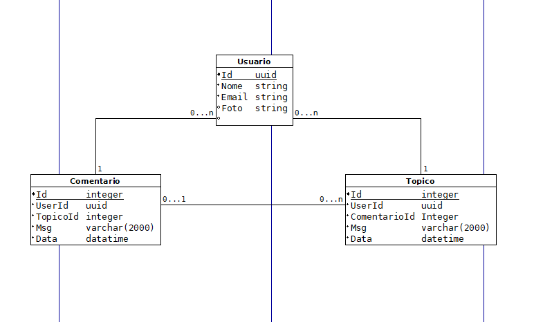
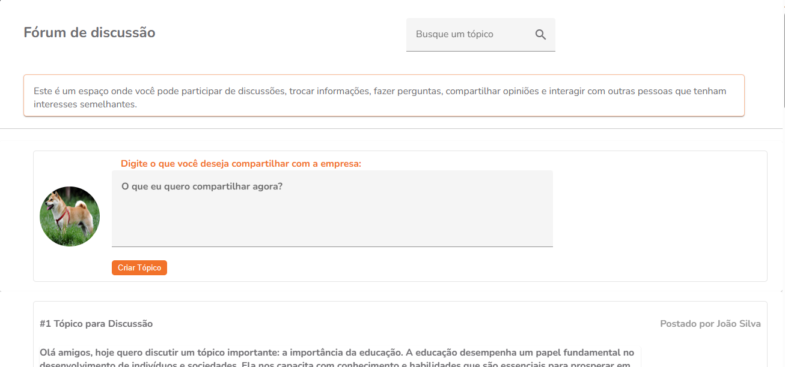
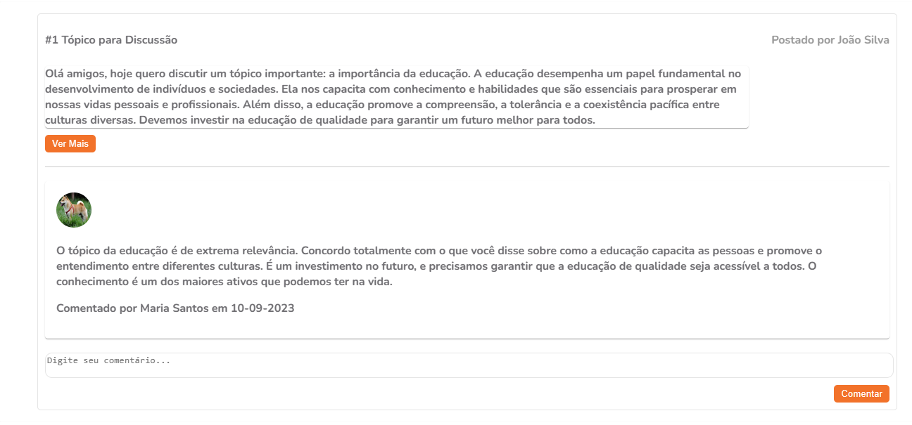

# O Desafio
Antes de começar a resolver o desafio, foram desenhados dois diagramas para facilitar o desenvolvimento do projeto. 
O Primeiro diagrama é da classe do projeto que ficou da seguinte maneira: 


Já das configurações do banco de dados e suas interações entre as chaves foi feito assim:
 

## Back-End/.NET
O projeto foi desenvolvido em um projeto MVC do .Net Core 6 e está hospedado na azure no link https://forumaevo20230910184902.azurewebsites.net. Foram criadas rotas para os usuarios de maneira simplificada, tentando seguir ao máximo o modelo especificado. A única alteração foi feita no campo Id que recebeu o tipo UUID. Essa decisão foi tomada para colocar alguma segurança nas rotas, além disso o SQL Server armazena-o como um arquivo hexadecimal. existem três usuários de testes cadastrado, mas fique a vontade para criar o seu, o usuários com seu e-mail suas id que pode ser utilizadas para autenticação:
```json
 {"email":"joao_silva@email.com", "id":87940dee-496c-42f6-a0a7-0246d5eec248}, 
 {"email":"maria_santos@email.com","id":f1a29d0f-72a6-4c9a-bd50-b3004d3f776b },
 {"email":"carlos_pereira@email.com  ","id":b66aeead-6347-4e6b-8c41-33d2763b8a6e} 

```
como ficou configurada a classe de usuário:
```json
{
    Id: Guid;
    Nome: string;
    Email: string;
    Foto: string;
}
````
# Rotas
As rotas foram documentadas exibindo os dados de entrada e seus retornos. Na documentação do Swagger foi adicionado um campo para inserir o Token "fake" que é o Id do Usuário, mas nada impede de as requisições sejam feitas pelo Postman ou qualquer outro software. Para utilizar as rotas que precisam de autenticação basta ir no Header adicionar uma variavel com nome de Token e seu valor.

Caso deseje executar o projeto em sua máquina, clone o repositório, utilize a pasta ForumAevo e altere a variável do banco de dados no arquivo appsettings.Development.json o projeto irá abrir no seu navegador. Como foi dito antes nada te impede de usar o Postman ou outro software para acessar as rotas

## Front-End /Angular
No front-End foi utilizado o angular versão 16.2 e o angular material, não tenho muita experiência com front tentei chegar o mais próximo possível da página solicitada.

Para executar o projeto clone o repositório e utilize a pasta ForumAevoFront, execute o seguinte comando:

`$ npm i`

para instalar as dependencias do javascript.

E para executar o projeto no angular execute:

`$ ng serve`

Do front apenas conseguir desenvolver um get nos comentários utilizando a api hospedada no azure, como pode ser visto nas imagens:

 


 